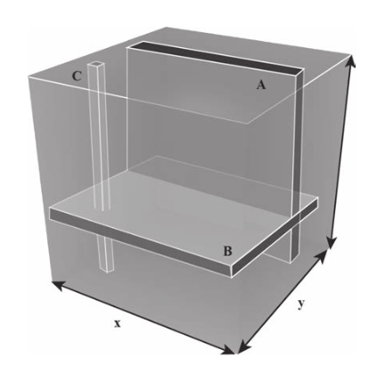
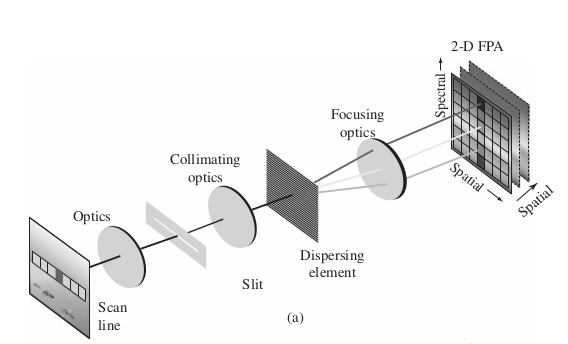

# Introduction

## 1.1 Introduction 
- **Remote Sensing**: data acquisition, processing, and interpretation of images, and related data, obtained from aircraft and satellites that record the interaction between matter and electromagnetic radiation
- **Source**: the source of electromagnetic radiation, e.g. the sun, black-body radiation, microwave radar, etc...
- **Atmospheric Radiation**: The EM radiation propagating through the atmosphere. Moderated by various processes including absorption and scattering
- **Earth's Surface Interation**: Amount and spectral distribution of radiation emitted/reflected by the earth's surface. This depends on 
  - physical properties of the matter 
  - wavelength of EM radiation that is sensed

## 1.2 Infrared Sensing Phenomenology 
- Main passive sources of EM radiation for remote sensing are light emitted by the sun and the self-emission via black-body radiation of objects due to their temperature. 

### 1.2.1 Sources of Infrared Radiation 
- **spectral radiant exitance** power per unit area emitted by the sun. We can treat this as a black body with temperature $5800 K$, maximum emittance at $\lambda = 0.50$ $\mu m$. 
- The Earth is ~$300 K$ with maximum spectral radiant emittance at $\lambda = 9.7$ $\mu m$. This is known as the **thermal infrared**

### 1.2.2 Atmospheric Propagation 
- Key parameter is the **path length** of atmosphered traveled through before it arrives at the remote sensing system. Main effects are:
  - **Atmospheric Scattering**: diffusion of radiation by particles in the atmosphere
  - **Absorption**
- Useful remote sensing spectral regions are obtained via the **Transmission Spectrum**.
  - **Reflective Range**: $0.35-2.5$ $\mu m$. Dominated by solar illumination
  - **Water Absorption**: $0.2-2.5$ $\mu m$. 
- **Atmospheric Windows**: Regions of low atmospheric absorption 

### 1.2.3 Reflectance and Emissivity Spectra
There are three processes that occur when EM radiation meets and interface: 
1. **Reflection**: Solar illumination dominates here. Consequently, this part of the spectrum is used to characterize the surface
   - *Specular Reflectors*: Flat surfaces that act like mirrors, i.e. $\theta_i = \theta_r$. 
   - *Diffuse (Lambertian) Reflectors*: Rough surfaces that reflect uniformly in all directions. 
   - *Real Reflectors*: Somewhere between the specular and diffuse.
2. **Absorption** 
3. **Transmission**
- Fractions vary as a function of $\lambda$ 
- Remote sensing usually cares about *diffuse* reflectors because this is the dominant type of most materials (water being an exception). 
- Reflectance of a material is characterized by its **Reflectance Spectrum**, that is, the percent of incident light reflected as a function of wavelength. 
  - Dips in reflectance spectrum are called **absorption features**
  - Peaks are called **Reflectance Peaks**
- **Emissivity Spectrum**: The ratio of radiant emittance at a given temperature to the radiant emittance of a black body at the same temperature. 

## 1.3 Hyperspectal Imaging Sensors
- **Hyperspectral Sensors** aka imaging spectrometers
  - scanning mechanism
  - imaging system
  - spectrometer
- 3 types of resolution 
1. spatial 
2. spectral 
3. radiant 
4. (temporal?)

### 1.3.1 Spectral-Spatial Data Collection and Organization 
- Data collected into **Data Cube**
  - 2 spatial dimensions, 1 spectral dimension
  

- Different types of rigs: 
  - Pushbroom scanner (ours) 
  - Staring System 
  - Fourier Transform Imaging Spectrometer (FTIS) 
  
### 1.3.2 Spatial Sampling 
- ground resolution elements are mapped to picture elements (pixels) 
- **IFOV**: Instantaneous Field of View
- **Cross track dimension** the projection of the long axis of the slit (i.e. the axis of the pushbroom sensors)
- **Along track dimension** the direction accumulated by traveling 
- **Ground Sample Distance** physical size of projected pixel element 

### 1.3.3 Spectral Sampling 
- Recovery of spectral info is *imperfect* due to finite sampling 
- **Spectral Response Function** is the weighing function that describes the wavelengths that are transmitted to a particular spectral sample 

### 1.3.4 Radiometric Sampling
- detector transforms  radiant power to electrical signal 
- electrical signal converted to numbe via analog-to-digital converter
- photon detectors 

### 1.3.5 Signal Consideratiosn 
Strength of signal is determined by: 
- *Terrain composition* $\to$ affects amount of radiant energy reflected/emitted from ground resolution element
- *Range* Intensity drops off by inverse square law. Further you are away, the worse the signal
- *Spectral Bandwidth* output signal of detector element is proportional to spectral bandwidth of the detector
- *Instantaneous Field of View* Decreasing IFOV increases spatial resolution but weakens the signal
- *Dwell Time* the time required to sweep the IFOV across the ground resolution element, i.e. the time-on-pixel. Longer dwell time $\to$ more accumulated photons $\to$ more signal. 

### 1.4 Data Preprocessing 
